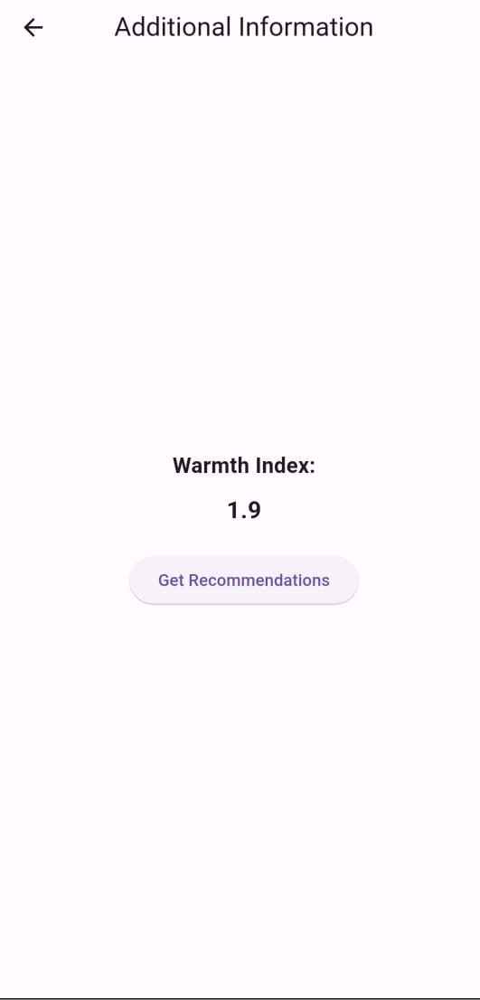

## warm_flutter

A new Flutter project.

## Getting Started

This project is a starting point for a Flutter application.

## Project Overview

Here are some sample images included in the project:

- **Image 1**  
  

- **Image 2**  
  

- **Image 3**  
  

## Prerequisites

Before running the application, make sure you:

Run the following commands to clean and fetch the necessary dependencies:

bash
Copy code
flutter clean
flutter pub get
Update the server links in both service files located in the service folder:

## Replace the placeholder URL with your computer's IPv4 address.

Example:
dart
Copy code
final String serverUrl = "http://your-ipv4-address:port";
To find your IPv4 address:
Windows: Run ipconfig in Command Prompt.
Mac/Linux: Run ifconfig in Terminal.
Ensure the mobile device running the APK (if not using an emulator) is connected to the same network as the computer hosting the server.

## Building and Running

Build the APK:

bash
Copy code
flutter build apk --release
Install the APK on an Android device:

## Copy the APK from build/app/outputs/flutter-apk/ to your device and install it manually.

Or use:
bash
Copy code
adb install build/app/outputs/flutter-apk/app-release.apk
Run the server on your computer before launching the app on your Android device.

## Open the application on your Android device, ensuring the server is running and the network configuration is correct.

## Additional Resources

A few resources to get you started if this is your first Flutter project:

Lab: Write your first Flutter app
Cookbook: Useful Flutter samples
For help getting started with Flutter development, view the online documentation, which offers tutorials, samples, guidance on mobile development, and a full API reference.
